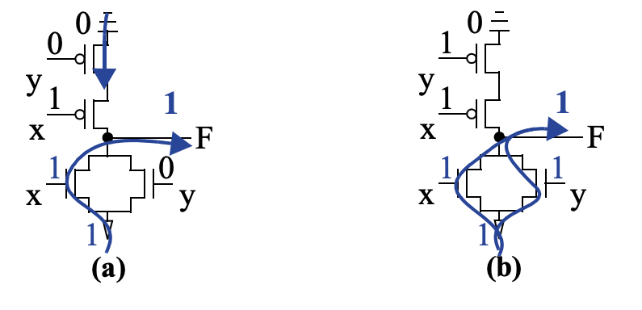
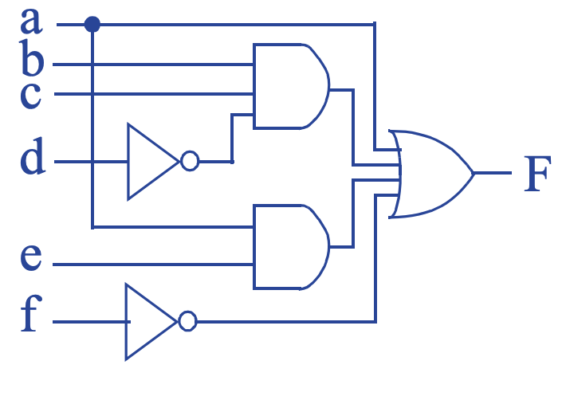
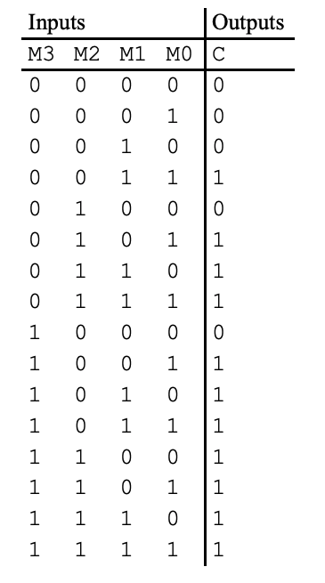
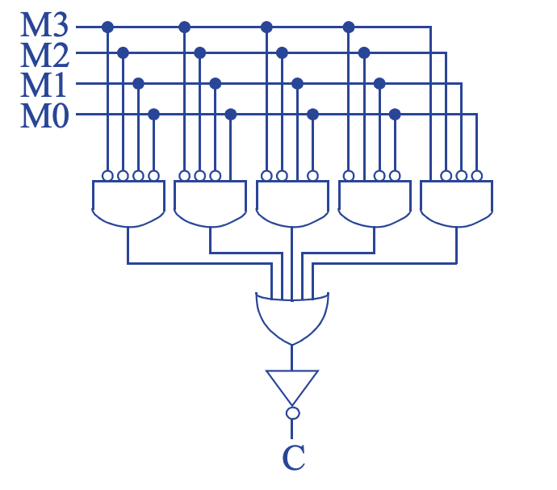
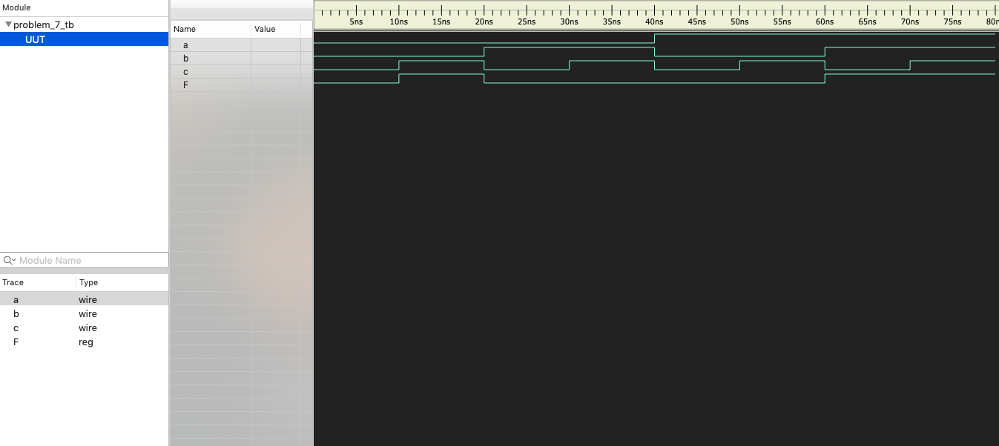
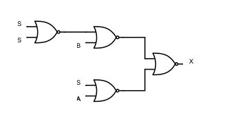
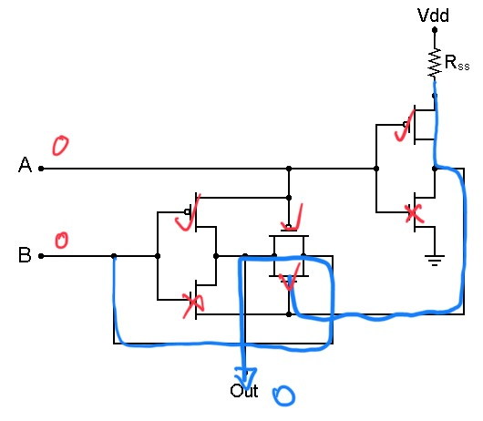
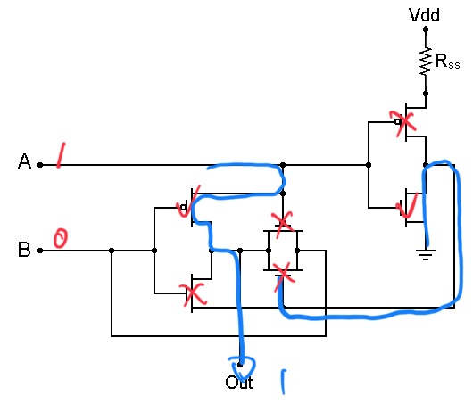
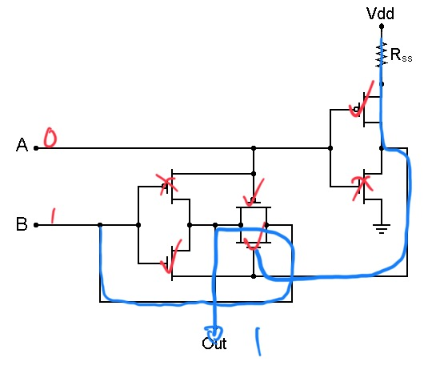
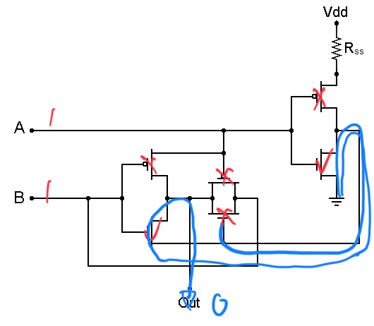

Embed math equations into Github Markdown file using a [web service](https://www.codecogs.com/latex/eqneditor.php)

# (5 pts)
Perform the following number-system conversions (show your work):

- a.   
- b.   
- c.   
- d.  

> - a.   
> - b.   
> - c.   
> - d.   

# (5 pts)
Evaluate the Boolean equation F = a AND (b OR (c AND d)) for the given values
of variables a, b, c, and d:  

- a. a=1, b=1, c=0, d=1  
- b. a=0, b=0, c=0, d=1  

> - a. F = 1 AND (1 OR (0 AND 1)) = 1 AND (1 OR 0) = 1 AND 1 = 1  
> - B. F = 0 AND (0 OR (0 AND 1)) = 0 AND (0 OR 0) = 0 AND 0 = 0  

# (5 pts)
Draw the OR(x,y) gate CMOS transistor circuit. Show the conduction path and output
value when: 

- a. x = 1 and y = 0
- b. x = 1 and y = 1

> 

# (5 pts)
Convert the following equation directly to gate-level circuits: F = a + bcd’ + ae + f’

> 

# (5 pts)
A network router connects multiple computers together and allows them to send messages to each other. If two or more computers send messages simultaneously, the messages “collide” and the messages must be resent. Using the combinational design process of Table 2.5, create a collision detection circuit for a router that connects 4 computers. The circuit has 4 inputs labeled M0 through M3 that are 1 when the corresponding computer is sending a message and 0 otherwise. The circuit has one output labeled C that is 1 when a collision is detected and 0 otherwise.

> Step 1: Capture the function (truth table)  
>   
> Step 2A: Create equation (canonical form)  
> C’ = M3’M2’M1’M0’ + M3’M2’M1’M0 + M3’M2’M1M0’ + M3’M2M1’M0’ + M3M2’M1’M0’  
> Step 2B: Create circuit  
> 

# (5 pts)
Convert the function F shown in the truth table in Table below to an equation. Don’t minimize the equation.

> F = a’b’c + abc’ + abc

# (5 pts)
Implement the function above and test its functionality via the testbench in [codes/exam/problem_7](../../codes/exam/problem_7). Include the waveform in the report.

> 

# (5 pts) 
Use the theorems of boolean algebra to simplify the following logic function: F = m·n·o + q’·p’·n’ + p·r·m + q’·o·m·p’ + m·r (hint, the result has three terms. Don't spend too much time on this one. If stuck, move on first)

> F = m·n·o + q’·p’·n’ + q’·o·m·p’ + m·r + p·r·m (rearrange)  
> F = m·n·o + q’·p’·n’ + q’·o·m·p’ + m·r (drop p·r·m)  
> F = n·(m·o) + (q’·p’)·n’ + (q’·p’)·(o·m) + m·r (associative)  
> F = n·(m·o) + (q’·p’)·n’ + m·r (consensus, a·b + a’·c + b·c = a·b + a’·c)  
> F = n·m·o + q’·p’·n’ + m·r

## **The following two are difficult, you can choose either one of them**
# (5 pts)
Implement a 1-bit 2-to-1 multiplexor using only 2-input NOR gates.

- a. Derive the truth table.
- b. Derive the sum-of-product expression.
- c. Derive the product-of-sum expression.
- d. Convert the product-of-sum circuit into NOR gate implementation.

> - a.  
> | S | A | B | C |
> |---|---|---|---|
> | 0 | 0 | x | 0 |
> | 0 | 1 | x | 1 |
> | 1 | x | 0 | 0 |
> | 1 | x | 1 | 1 |

> - b. X = S'A + SB
> - c. X = (S + A)(S' + B)
> - d. X = X''=[{( S + A )( S' + B )}']'=[( S + A )' + ( S' + B )']'  
> 

# (5 pts)
Analyze the CMOS circuit below. 

- a. Draw the conduction paths for
    - A = 0, B = 0
    - A = 1, B = 0
    - A = 0, B = 1
    - A = 1, B = 1
- b. Write the truth table.
- c. What gate is it?

> a.  

> 
> 
> 
> 

> b.  
> | A | B | X |
> |---|---|---|
> | 0 | 0 | 0 |
> | 1 | 0 | 1 |
> | 1 | 0 | 1 |
> | 1 | 1 | 0 |

> c. XOR
